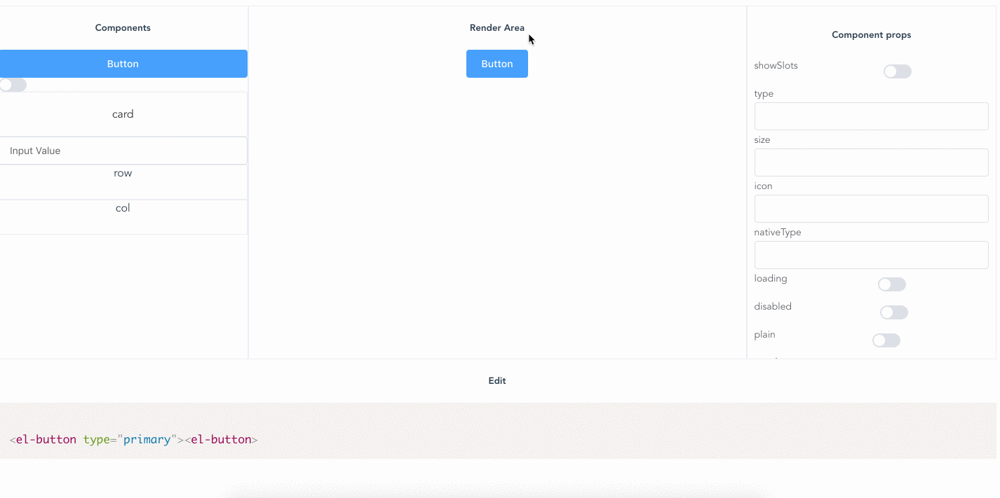

# vue-component-editor

This repo contains a demo that extracts slots & props of any vue component and exposes a UI to edit components.

## Demo

This is EXPERIMENTAL and should NOT be used in any production application as it's nowhere near ready to be used in production. 
